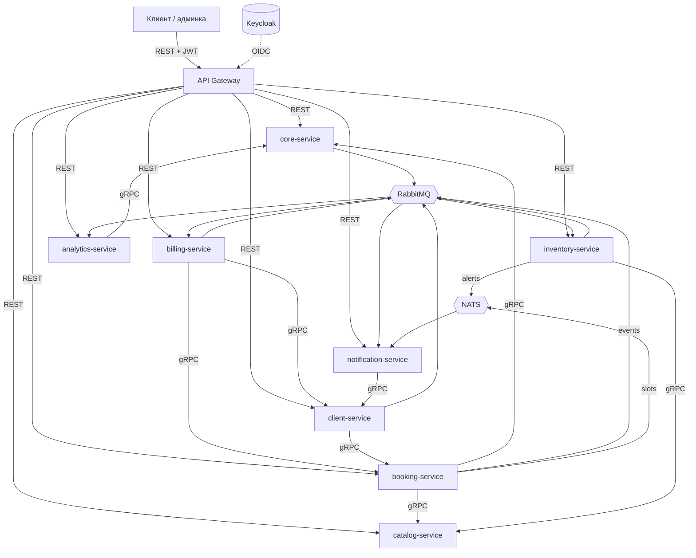

# Mirea CRM — микросервисная архитектура

Учебный проект по курсу «Микросервисная архитектура». Практические работы №1–10 лежат
в [`manuals/`](manuals/).

**Предметная область:** CRM для малого бизнеса сферы услуг — барбершопы, студии,
автосервисы, частные клиники, специалистские. Сеть ведёт филиалы и специалистов, клиенты
записываются на услуги, на каждую процедуру списываются расходники, за запись
выставляется счёт.

Модель нейтральна к нише: везде, где клиент записывается к специалисту на услугу
определённой длительности, а на неё расходуются материалы.

**Масштаб:** 8 собственных микросервисов плюс инфраструктурный API-шлюз.

---

## Требования практикумов

| Работа | Что требуется | Где закрывается |
|---|---|---|
| ПР1 | Доменные события + глоссарий | Event Storming модель, `docs/` |
| ПР2 | Команды, действующие лица, бизнес-правила | там же |
| ПР3 | Агрегаты → ограниченные контексты | 8 сервисов ниже |
| ПР4 | Связи между контекстами, стили общения, БД | разделы «Транспорт» и «Данные» |
| ПР5 | RabbitMQ, варианты по билету | отдельная работа, вне этого репозитория |
| ПР6 | ≥2 своих сервиса, 2–5 эндпоинтов, ≥1 с БД, вложенные вызовы, Docker Compose | все сервисы |
| ПР7 | CI/CD: DockerHub + serverless в Яндекс.Облаке | `.github/workflows/` |
| ПР8 | Два вида тестов из трёх, встроенных в CI | `tests/` в каждом сервисе |
| ПР9 | Keycloak + OIDC, проверка JWT на шлюзе | `services/gateway/`, готово |
| ПР10 | Две технологии observability из трёх | OpenTelemetry + Jaeger, Prometheus + Grafana |

ПР6 требует минимум два сервиса — здесь их восемь, поэтому требования работы
выполняются с запасом. Каждый сервис держит **от 2 до 5 REST-эндпоинтов**, как просит
методичка.

---

## Архитектура



`core-service` — центр системы: единственный источник правды об организации
(компании, филиалы, сотрудники, графики). К нему синхронно ходят почти все остальные.

Маршрутизацией он при этом **не** занимается — это делает тонкий `gateway`. Если
свалить обе роли в один сервис, получается распределённый монолит: релиз ядра
кладёт всю систему, а на трассировке каждый запрос проходит через ядро дважды.
Шлюз всё равно нужен по ПР9, так что разделение бесплатное.

---

## Сервисы

| Сервис | Язык | БД | Роль |
|---|---|---|---|
| [`gateway`](services/gateway/) | Python | — | Проверка JWT, маршрутизация. Инфраструктура, в счёт восьми не идёт |
| [`core-service`](services/core-service/) | Python | `core_db` | Компании, филиалы, сотрудники, должности, графики |
| [`client-service`](services/client-service/) | Python | `client_db` | Клиентская база, контакты, лояльность |
| [`booking-service`](services/booking-service/) | Go | `booking_db` | Записи, расписание специалистов, слоты |
| [`catalog-service`](services/catalog-service/) | Python | `catalog_db` | Услуги, прайс, нормативы расходников |
| [`inventory-service`](services/inventory-service/) | Go | `inventory_db` | Склад расходников, списание, остатки |
| [`billing-service`](services/billing-service/) | Python | `billing_db` | Счета, оплаты, комиссия специалиста |
| [`notification-service`](services/notification-service/) | Go | — | Напоминания клиентам, алерты администраторам |
| [`analytics-service`](services/analytics-service/) | Python | `analytics_db` | Выручка, загрузка специалистов, расход материалов |

Go взят там, где он уместен по существу: конкурентная выдача и захват слотов,
счётчики остатков, лёгкий рассыльщик. Не «для галочки» — на защите это разные ответы.

---

## Транспорт

Четыре канала, каждый со своей зоной ответственности.

### REST — наружу

Всё, что приходит от клиента, идёт через `gateway` по HTTP/JSON. Только шлюз
смотрит наружу, сервисы публичных портов не имеют.

### gRPC — между сервисами

Внутренние синхронные вызовы. Контракты в [`proto/`](proto/) — единственный источник
правды, из него генерируются и Python-, и Go-структуры. Это же решает главную боль
разноязычного проекта: рассинхрон контрактов ломает сборку, а не всплывает на
интеграции.

| Вызов | Метод | Зачем |
|---|---|---|
| `booking → core` | `GetEmployeeSchedule`, `GetBranch` | график специалиста, принадлежность филиалу |
| `booking → catalog` | `GetService` | длительность и цена услуги |
| `inventory → catalog` | `GetConsumptionNorms` | норматив расходников на процедуру |
| `billing → booking` | `GetAppointment` | детали визита по `appointment_id` |
| `billing → client` | `AddLoyaltyPoints` | начислить баллы после оплаты |
| `client → booking` | `ListClientAppointments` | история записей для карточки клиента |
| `notification → client` | `GetClientContacts` | контакты и предпочитаемый канал связи |
| `analytics → core` | `GetBranch`, `ListEmployees` | справочник для отчётов |

gRPC-серверы поднимают `core`, `catalog`, `booking` и `client`.

### RabbitMQ — доменные события

Всё, что меняет состояние системы и что нельзя потерять. Topic-обменник
`mirea.events`, durable-очереди, ручные подтверждения.

| Routing key | Публикует | Потребляют |
|---|---|---|
| `branch.opened` | core | analytics |
| `employee.hired` | core | analytics |
| `client.registered` | client | analytics |
| `appointment.created` | booking | notification, analytics |
| `appointment.cancelled` | booking | notification, analytics |
| `appointment.completed` | booking | inventory, billing, analytics |
| `consumables.written_off` | inventory | analytics |
| `stock.low` | inventory | notification, analytics |
| `invoice.issued` | billing | notification |
| `invoice.paid` | billing | analytics |

`analytics` и `notification` биндятся на `#` и `*.{created,cancelled,low,issued}`
соответственно.

### NATS — эфемерный real-time

Широковещательные обновления, где потеря сообщения безвредна, а важны латентность
и отсутствие очередей. Core pub/sub, без JetStream.

| Subject | Публикует | Что это |
|---|---|---|
| `mirea.branch.{id}.schedule` | booking | слот занят/освободился — живое табло на ресепшене |
| `mirea.branch.{id}.alerts` | inventory | «краска заканчивается» админу филиала прямо сейчас |
| `mirea.heartbeat` | все | presence-сигналы сервисов |

**Почему два брокера.** RabbitMQ — доменные события, меняющие состояние: списание
расходников или выставленный счёт потерять нельзя, нужны durable-очереди и
подтверждения. NATS — broadcast без гарантий, где сообщение устаревает за секунды
и подписчик ресинкнется сам. Разные классы доставки.

Честная оговорка для отчёта: в реальном проекте такого масштаба обошлись бы одним
брокером. Второй взят, чтобы показать оба класса задач. NATS-слой изолирован и
снимается без правок доменной логики.

---

## Данные

База на сервис — `core_db`, `client_db`, `booking_db`, `catalog_db`, `inventory_db`,
`billing_db`, `analytics_db`. Сервисы не ходят в чужие базы, только через API.

Физически это **один инстанс Postgres** с семью базами и отдельным пользователем на
каждую. Восемь контейнеров Postgres ноутбук переживёт плохо, а изоляция схемы при
этом соблюдена — на модели ПР4 они и рисуются как семь отдельных БД.

`notification-service` без БД: шаблоны в конфиге, история отправок в логах.

---

## Структура репозитория

```
.
├── README.md
├── manuals/            практические работы 1–10 (PDF)
├── proto/              .proto-контракты, единый источник правды
├── gen/                сгенерированный код (в git не хранится)
├── buf.yaml            модуль и правила линтинга контрактов
├── buf.gen.yaml        генерация в gen/go и gen/python
├── services/           восемь сервисов + шлюз, у каждого свой README
├── deploy/             init-скрипты Postgres, топология RabbitMQ, realm Keycloak
├── docker-compose.yml  инфраструктура и сервисы
└── .github/workflows/  CI/CD (ПР7)
```

## Запуск

```bash
cp .env.example .env

# сгенерировать код из контрактов
go install github.com/bufbuild/buf/cmd/buf@latest
buf generate

# поднять инфраструктуру
docker compose up -d
```

Единственный вход — шлюз на `:8000`. Токен берётся у Keycloak, а на отладке —
через `POST /auth/token` шлюза:

```bash
TOKEN=$(curl -s -X POST localhost:8000/auth/token \
  -H 'Content-Type: application/json' \
  -d '{"username":"owner","password":"owner"}' | jq -r .access_token)

curl -s localhost:8000/routes | jq          # что вообще можно и кому
curl -s localhost:8000/branches/$BRANCH/services -H "Authorization: Bearer $TOKEN"
```

| Учётная запись | Пароль | Роль |
|---|---|---|
| `owner` | `owner` | `admin` |
| `admin-tverskaya` | `manager` | `manager` |
| `specialist-anna` | `specialist` | `specialist` |

| Что | Адрес | Доступ |
|---|---|---|
| RabbitMQ, панель | http://localhost:15672 | `guest` / `guest` |
| NATS, мониторинг | http://localhost:8222 | — |
| Шлюз, вход в систему | http://localhost:8000 | токен из Keycloak |
| Keycloak | http://localhost:8080 | `admin` / `admin` |
| Postgres | `localhost:5432` | пользователь на каждую базу |
| Jaeger | http://localhost:16686 | профиль `observability` |

Трассировка поднимается отдельно, чтобы не висела зря:

```bash
docker compose --profile observability up -d
```

Обменник `mirea.events`, очереди потребителей и dead-letter объявляются
декларативно из `deploy/rabbitmq/definitions.json` — после `docker compose down -v`
топология восстанавливается сама, руками ничего создавать не нужно.

---

## Статус

| Что | Состояние |
|---|---|
| Контракты `proto/` | 9 gRPC-методов, 10 событий, генерация через `buf` |
| Глоссарий | [`docs/glossary.md`](docs/glossary.md), ПР1–4 |
| Инфраструктура | Postgres, RabbitMQ, NATS, Keycloak, Jaeger в compose |
| `core-service` | готов: REST, gRPC, события, Docker, 40 тестов |
| `booking-service` | готов: REST, gRPC, RabbitMQ, NATS, Docker, 34 теста |
| `catalog-service` | готов: REST, gRPC, Docker, 13 тестов |
| `inventory-service` | готов: REST, консьюмер, RabbitMQ, NATS, Docker, 20 тестов |
| `client-service` | готов: REST, gRPC в обе стороны, Docker, 14 тестов |
| `billing-service` | готов: REST, консьюмер, gRPC-клиент, Docker, 15 тестов |
| `notification-service` | готов: REST, консьюмер RabbitMQ + NATS, Docker, 10 тестов |
| `analytics-service` | готов: REST, консьюмер `#`, gRPC-клиент, Docker, 16 тестов |
| `gateway` (ПР9) | готов: OIDC, роли, проброс личности, Docker, 50 тестов |

**Все восемь сервисов готовы, вход закрыт шлюзом.** Система работает целиком:
запись через три сервиса синхронно, завершение расходится на четырёх потребителей
асинхронно, аналитика видит весь поток. Снаружи открыт один порт — `:8000`,
остальные слушают петлю и оставлены для отладки.

Дальше — сквозные работы: ПР10 (observability) и ПР7 (CI/CD). Каждая делается
один раз на всю систему.
