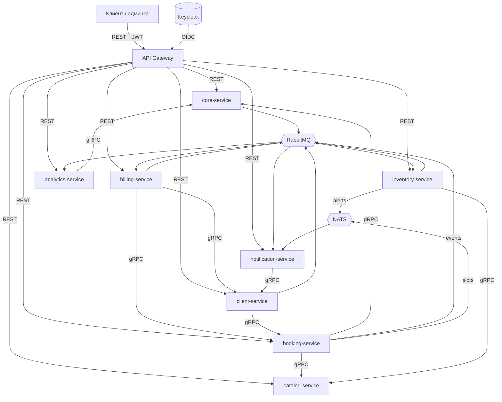

# Mirea CRM

[](https://github.com/leo-need-more-coffee/mireacrm/actions/workflows/ci.yml)

Микросервисная CRM для малого бизнеса сферы услуг: восемь сервисов на Python и Go
за единым API-шлюзом, синхронное взаимодействие по gRPC, асинхронное — через
RabbitMQ и NATS.

**Предметная область.** Сеть ведёт филиалы и специалистов, клиенты записываются на
услуги, на каждую процедуру списываются расходные материалы, за визит выставляется
счёт. Модель нейтральна к нише: барбершоп, студия, автосервис, частная клиника —
везде, где клиент записывается к специалисту на услугу известной длительности,
а на неё расходуются материалы.

```bash
docker compose up -d
curl -s localhost:8000/routes | jq
```

---

## Архитектура



`core-service` — центр системы: единственный источник правды об организации
(компании, филиалы, сотрудники, графики). К нему синхронно ходят почти все остальные.

Маршрутизацией он при этом **не** занимается — это дело тонкого `gateway`. Если
свалить обе роли в один сервис, получается распределённый монолит: релиз ядра
кладёт всю систему, а каждый запрос проходит через ядро дважды.

Подробное описание архитектуры со схемами — [`docs/architecture.pdf`](docs/architecture.pdf).

---

## Сервисы

| Сервис | Язык | БД | Роль |
|---|---|---|---|
| [`gateway`](services/gateway/) | Python | — | Проверка JWT, роли, маршрутизация. Единственный публичный порт |
| [`core-service`](services/core-service/) | Python | `core_db` | Компании, филиалы, сотрудники, должности, графики |
| [`client-service`](services/client-service/) | Python | `client_db` | Клиентская база, контакты, лояльность |
| [`booking-service`](services/booking-service/) | Go | `booking_db` | Записи, расписание специалистов, слоты |
| [`catalog-service`](services/catalog-service/) | Python | `catalog_db` | Услуги, прайс, нормативы расхода материалов |
| [`inventory-service`](services/inventory-service/) | Go | `inventory_db` | Склад расходников, списание, остатки |
| [`billing-service`](services/billing-service/) | Python | `billing_db` | Счета, оплаты, комиссия специалиста |
| [`notification-service`](services/notification-service/) | Go | — | Напоминания клиентам, оповещения администраторам |
| [`analytics-service`](services/analytics-service/) | Python | `analytics_db` | Выручка, загрузка специалистов, расход материалов |

У каждого сервиса свой README с описанием ответственности, API и принятых решений.

Go взят там, где он уместен по существу: конкурентная выдача и захват слотов,
счётчики остатков, лёгкий рассыльщик, держащий соединения с двумя брокерами.
Python — там, где ценнее скорость разработки и богатая работа с данными.

---

## Транспорт

Четыре канала, у каждого своя зона ответственности.

### REST — наружу

Всё, что приходит от человека, идёт через `gateway` по HTTP/JSON. Наружу открыт
один порт; сервисы за ним публикуются только на петлю и только для отладки.

### gRPC — между сервисами

Внутренние синхронные вызовы. Контракты в [`proto/`](proto/) — единственный
источник правды, из них генерируются и Python-, и Go-структуры. Это же решает
главную боль разноязычного проекта: рассинхрон контрактов ломает сборку, а не
всплывает на интеграции.

| Вызов | Метод | Зачем |
|---|---|---|
| `booking → core` | `GetEmployeeSchedule`, `GetBranch` | график специалиста, принадлежность филиалу |
| `booking → catalog` | `GetService` | длительность и цена услуги |
| `inventory → catalog` | `GetConsumptionNorms` | норматив расхода материалов на процедуру |
| `billing → booking` | `GetAppointment` | детали визита по `appointment_id` |
| `billing → client` | `AddLoyaltyPoints` | начислить баллы после оплаты |
| `client → booking` | `ListClientAppointments` | история записей для карточки клиента |
| `notification → client` | `GetClientContacts` | контакты и предпочитаемый канал связи |
| `analytics → core` | `GetBranch`, `ListEmployees` | справочник для отчётов |

gRPC-серверы поднимают `core`, `catalog`, `booking` и `client`. Включена рефлексия,
поэтому `grpcurl` работает без `.proto` под рукой.

### RabbitMQ — доменные события

Всё, что меняет состояние системы и что нельзя потерять. Topic-обменник
`mirea.events`, quorum-очереди, ручные подтверждения, dead-letter.

| Routing key | Публикует | Потребляют |
|---|---|---|
| `branch.opened` | core | analytics |
| `employee.hired` | core | analytics |
| `client.registered` | client | analytics |
| `appointment.created` | booking | notification, analytics |
| `appointment.cancelled` | booking | notification, analytics |
| `appointment.completed` | booking | inventory, billing, analytics |
| `consumables.written_off` | inventory | analytics |
| `stock.low` | inventory | notification, analytics |
| `invoice.issued` | billing | notification |
| `invoice.paid` | billing | analytics |

`analytics` биндится на `#`, `notification` — на `*.{created,cancelled,low,issued}`.

**Осечка обработчика — не приговор событию.** Обработчик падает по двум разным
причинам, и различать их обязательно. Сосед перезапускается или база моргнула —
событие возвращается в очередь и обрабатывается снова; повторить безопасно,
потому что отметка об обработке пишется той же транзакцией, что и эффект.
Payload не проходит проверку — повторять нечего, следующая попытка разобьётся
о то же самое, и событие сразу уходит в dead-letter.

Повторы ограничены пятью попытками с растущей паузой. Дальше событие ложится
в dead-letter, а `x-delivery-limit` на очередях — страховка на стороне брокера
на случай потребителя, который забудет остановиться сам. Без всего этого
перезапуск `booking` во время обработки навсегда терял бы счёт за визит
и списание материалов: одна осечка — и событие в dead-letter, откуда его
достанет только человек.

События намеренно тонкие: несут идентификаторы, а не снимки. Детали потребитель
запрашивает по gRPC, поэтому payload не разрастается и не требует версионирования
при каждом изменении карточки.

### NATS — эфемерный real-time

Широковещательные обновления, где потеря сообщения безвредна, а важны латентность
и отсутствие очередей. Core pub/sub, без JetStream.

| Subject | Публикует | Что это |
|---|---|---|
| `mirea.branch.{id}.schedule` | booking | слот занят или освободился — живое табло на ресепшене |
| `mirea.branch.{id}.alerts` | inventory | «краска заканчивается» администратору филиала прямо сейчас |
| `mirea.heartbeat` | все | presence-сигналы сервисов |

**Почему два брокера.** RabbitMQ несёт доменные события, меняющие состояние:
списание материалов или выставленный счёт потерять нельзя, нужны durable-очереди
и подтверждения. NATS — broadcast без гарантий, где сообщение устаревает за
секунды, а подписчик ресинхронизируется сам. Это разные классы доставки, и
смешивать их в одной шине означает либо переплачивать за надёжность там, где она
не нужна, либо терять её там, где нужна.

Оговорка по существу: проекту такого масштаба хватило бы одного брокера. Второй
взят, чтобы развести оба класса задач явно. NATS-слой изолирован и снимается без
правок доменной логики.

---

## Наблюдаемость

Трассировка и метрики, обе технологии подняты вместе с системой.

### Распределённая трассировка

OpenTelemetry в девяти сервисах, экспорт по OTLP в Jaeger. Один запрос виден
целиком — включая то, что происходит уже после ответа клиенту:

```
POST /appointments/{id}/complete        gateway
  └─ POST /appointments/{id}/complete   booking      захват и закрытие визита
      └─ publish appointment.completed  booking      событие ушло в шину
          ├─ consume appointment.completed  inventory   → GetConsumptionNorms → catalog
          ├─ consume appointment.completed  billing     → GetAppointment → booking
          └─ consume appointment.completed  analytics   → витрины
```

Трасса не рвётся ни на границе языков, ни на границе брокера: контекст едет
в поле `traceparent` конверта события, а потребитель продолжает трассу издателя.
Для этого не понадобилось ничего изобретать — заголовок W3C ходил по системе
с самого начала, оставалось связать его с активным спаном.

Адрес коллектора задаётся переменной `<СЕРВИС>_OTLP_ENDPOINT`; пустое значение
выключает экспорт, поэтому тесты и локальный запуск не требуют инфраструктуры.

### Метрики

Каждый сервис отдаёт `/metrics`, Prometheus собирает их раз в 10 секунд.

| Метрика | О чём |
|---|---|
| `http_requests_total` | запросы по сервису, маршруту и коду ответа |
| `http_request_duration_seconds` | гистограмма времени ответа |
| `grpc_server_requests_total` | вызовы gRPC по методу и коду |
| `domain_events_published_total` | публикация событий по ключу |
| `domain_events_consumed_total` | обработка событий: `handled`, `skipped`, `retried`, `failed`, `unparsable` |

Метка маршрута — шаблон (`/branches/{branch_id}/employees`), а не фактический
путь: иначе каждый идентификатор в URL заводил бы свой временной ряд.

Отказы потребителя различаются по исходу. `retried` — обработчик оступился,
событие вернулось в очередь и будет обработано снова. `failed` — попытки
исчерпаны или повторять нечего, событие ушло в dead-letter. `unparsable` —
конверт не разобрался вовсе; этот случай особенно неприятен тем, что событие
уходит в dead-letter молча, и без счётчика заметить его нечем.

Ровный ненулевой `retried` при нулевом `failed` — нормальная жизнь системы:
соседа перезапустили, события подождали и прошли. Растущий `failed` означает,
что что-то не чинится само.

Метрики базы снимает `postgres_exporter`: соединения, транзакции, размеры по
каждой из семи баз.

Брокер отдаёт метрики сам — плагин `rabbitmq_prometheus` включён в образе,
отдельный экспортёр не нужен. Глубина очередей собирается отдельной работой
с `/metrics/detailed`: на обычном `/metrics` разбивки по очередям нет
намеренно, чтобы сбор не дорожал с их числом.

| Метрика | О чём |
|---|---|
| `rabbitmq_detailed_queue_messages` | сколько сообщений ждёт в очереди |
| `rabbitmq_detailed_queue_messages_unacked` | взято потребителем, но ещё не подтверждено |

Счётчики сервисов и глубина очередей отвечают на разные вопросы, и нужны оба.
`domain_events_consumed_total` говорит, что делал потребитель; глубина очереди —
успевал ли он вообще. Потребитель, который лежит, не увеличивает ни один свой
счётчик: по его метрикам всё тихо, и заметить это можно только по растущей
очереди.

### Дашборд

Grafana заводит источники данных и панели из [`deploy/grafana`](deploy/grafana/) —
руками настраивать нечего. Дашборд «Mirea CRM — сервисы, шина и база»: нагрузка,
доля ошибок, задержка по 95-му процентилю, самые медленные маршруты, поток
событий, повторы и отказы потребителей, глубина очередей, вызовы gRPC
и состояние базы.

В верхнем ряду рядом с нагрузкой и долей ошибок стоит счётчик dead-letter.
В здоровой системе там ноль: туда попадает только то, что не починилось
за пять попыток, — и ненулевое значение означает событие, которое уже никто
не обработает без человека.

---

## Данные

База на сервис: `core_db`, `client_db`, `booking_db`, `catalog_db`, `inventory_db`,
`billing_db`, `analytics_db`. Сервисы не ходят в чужие базы — только через API.

Физически это **один инстанс Postgres** с семью базами и отдельным пользователем на
каждую. Восемь контейнеров Postgres ноутбук переживёт плохо, а изоляция схемы при
этом соблюдена: в чужую базу сервис не попадёт даже случайно.

`notification-service` без базы: шаблоны в конфигурации, история отправок в логах.

Инварианты, которые нельзя доверить приложению, живут в базе: непересекающиеся
смены и захват слота — ограничения `EXCLUDE USING gist`, неотрицательный остаток —
`CHECK`. Под гонкой это единственная надёжная защита.

---

## Быстрый старт

```bash
cp .env.example .env
docker compose up -d
```

Поднимется инфраструктура и все девять контейнеров. Единственный вход — шлюз на
`:8000`. Токен выдаёт Keycloak; на отладке удобнее через шлюз:

```bash
TOKEN=$(curl -s -X POST localhost:8000/auth/token \
  -H 'Content-Type: application/json' \
  -d '{"username":"owner","password":"owner"}' | jq -r .access_token)

curl -s localhost:8000/routes | jq                 # какие запросы есть и кому доступны
curl -s localhost:8000/templates -H "Authorization: Bearer $TOKEN"
```

Учётные записи создаются при импорте realm:

| Учётная запись | Пароль | Роль |
|---|---|---|
| `owner` | `owner` | `admin` |
| `admin-tverskaya` | `manager` | `manager` |
| `specialist-anna` | `specialist` | `specialist` |

Пароли одноразовые и предназначены только для локального запуска.

| Что | Адрес | Доступ |
|---|---|---|
| Шлюз — вход в систему | http://localhost:8000 | токен Keycloak |
| Keycloak | http://localhost:8080 | `admin` / `admin` |
| RabbitMQ, панель | http://localhost:15672 | `guest` / `guest` |
| NATS, мониторинг | http://localhost:8222 | — |
| Postgres | `localhost:5432` | свой пользователь на каждую базу |
| Jaeger — трассировка | http://localhost:16686 | — |
| Grafana — дашборды | http://localhost:3000 | `admin` / `admin`, чтение без входа |
| Prometheus | http://localhost:9090 | — |

Обменник `mirea.events`, очереди потребителей и dead-letter объявляются
декларативно из [`deploy/rabbitmq/definitions.json`](deploy/rabbitmq/definitions.json):
после `docker compose down -v` топология восстанавливается сама.

Аргументы очереди задаются при её создании, и импорт определений уже
существующую очередь не переделывает. Поэтому изменения в `definitions.json`
доезжают только через `docker compose down -v`. Система при этом продолжает
работать на старой топологии: `x-delivery-limit` — страховка, а число попыток
ограничивает сам потребитель.

---

## Разработка

Сгенерированный из контрактов код хранится в репозитории, поэтому для сборки
`buf` не нужен. Он нужен только при изменении `.proto`:

```bash
go install github.com/bufbuild/buf/cmd/buf@latest
buf lint
buf generate          # обновит gen/go и gen/python
```

### Общий обвяз

Транспортный слой у всех сервисов одинаков: соединение с базой, конверт события
и его публикация, разбор личности из заголовков шлюза, сквозная трасса, метрики,
каркас процесса. Он вынесен в [`libs/`](libs/) — `py-common` для Python,
`go-common` для Go — и подключается replace-директивой и путём в `pyproject.toml`,
без публикации в реестр.

Вынесено ровно то, что не знает предметной области. **Правила доступа остались
в сервисах**: `app/infra/access.py` у Python, `internal/access` у booking. Кто
чей объект вправе видеть — знание сервиса-владельца, и общая на всех проверка
означала бы, что правило меняется у восьми сервисов одновременно. Это ровно тот
случай, когда общий код превращает систему в распределённый монолит.

Зависимости обвяза разложены по дополнениям: `db`, `events`, `grpc`. Шлюз берёт
только ядро, поэтому ни драйвер Postgres, ни клиент брокера в его образ не
попадают — общая библиотека не тянет за собой то, чем потребитель не пользуется.

Оговорка по существу. В монорепозитории обе библиотеки подключены путём:
Go — через `replace`, Python — установкой из каталога. Значит, версия ни у кого
не прибита и все сервисы собираются против рабочей копии: правка обвяза задевает
их разом. Поэтому конвейер проверяет его отдельной работой и до тестов сервисов —
поломка общего кода видна на нём, а не девятью красными работами подряд.
Фиксировать версию имеет смысл, когда библиотека публикуется в реестр; до тех
пор эту роль выполняет общий коммит.

Тесты — 304, два вида: unit без ввода-вывода и интеграционные против настоящего
Postgres. Интеграционным нужен запущенный `docker compose up -d postgres`.

```bash
# Python-сервис
cd services/core-service
python -m venv .venv
.venv/bin/pip install -e ../../gen/python -e "../../libs/py-common[db,events,grpc]"
.venv/bin/pip install -e ".[dev]"
.venv/bin/python -m pytest
.venv/bin/ruff check .

# Go-сервис
cd services/booking-service
go test ./...                      # unit
go test -tags integration ./...    # плюс интеграционные
```

Интеграционные тесты на Go отделены признаком сборки `integration`, на Python — по
каталогам `tests/unit` и `tests/integration`.

Спецификация публичного интерфейса не пишется руками, а собирается из маршрутной
таблицы шлюза и описаний самих сервисов:

```bash
docker compose up -d
python3 docs/build-openapi.py     # обновит docs/openapi.yaml
```

Расхождение с кодом невозможно по построению: маршрута, которого нет в таблице
шлюза, в спецификации не будет, а маршрут без схемы будет назван в отчёте сборки.
Конвейер отдельно проверяет, что описаны все маршруты.

---

## Разграничение доступа

Проверка разнесена на два уровня, и это не дублирование — уровни отвечают на
разные вопросы.

**Роль проверяет шлюз.** Может ли этот пользователь вообще обращаться к такому
запросу. Правила описаны маршрутной таблицей и читаются по `GET /routes`.

**Принадлежность проверяет сервис-владелец.** Его ли это визит, его ли график,
его ли комиссия. Шлюзу это неизвестно и известно быть не должно: он не знает,
кому принадлежит запись.

Чтобы сервису было с чем сравнивать, шлюз выясняет у `core-service`, какой
сотрудник соответствует учётной записи, и передаёт его в заголовке рядом с
идентификатором пользователя. Спрашивается это только для непривилегированных:
администратору и управляющему принадлежность безразлична.

| Запрос | Кто владеет | Что проверяется |
|---|---|---|
| `GET /employees/{id}/schedule` | core | специалист видит только свой график |
| `GET /appointments/{id}` | booking | специалист видит только свои визиты |
| `POST /appointments/{id}/complete` | booking | закрыть можно только свой визит |
| `GET /employees/{id}/commission` | billing | специалист видит только свой заработок |
| `GET /employees/{id}/workload` | analytics | специалист видит только свою загрузку |

Правило одно на систему: администратор и управляющий работают с чужими
объектами, специалист — только со своими. Учётной записи может не
соответствовать ни один сотрудник — тогда доступа к чужому нет вовсе.

Проверка при закрытии визита стоит **до** смены состояния. Иначе событие
`appointment.completed` успело бы уйти в шину, и потребители начали бы списывать
материалы и выставлять счёт по чужому визиту.

---

## Непрерывная интеграция

[`.github/workflows/ci.yml`](.github/workflows/ci.yml) — один конвейер, в котором
тесты стоят перед всем остальным: образ не публикуется, пока весь набор не прошёл.

| Работа | Что делает |
|---|---|
| Контракты | линтер `.proto`, `gen/` не разошёлся с `proto/`, спецификация покрывает все маршруты |
| Тесты Python | шесть сервисов параллельно: линтер, модульные, интеграционные |
| Тесты Go | три сервиса параллельно: формат, `go vet`, обе группы тестов |
| Публикация | образ `inventory-service` в DockerHub |
| Развёртывание | `catalog-service` бессерверным контейнером в Яндекс.Облаке |

Интеграционным тестам нужна база: Postgres поднимается служебным контейнером, а
семь баз с отдельными пользователями заводит тот же
[`init-databases.sh`](deploy/postgres/init-databases.sh), что и при локальном
запуске. Скрипт выполняется тем же образом Postgres — так конвейер не зависит от
того, какие утилиты оказались на раннере.

Проверка «сгенерированный код соответствует контрактам» ловит правку `.proto`
без перегенерации. Без неё поломка всплывает у того, кто соберёт проект следующим.

### Почему именно эти два сервиса

`inventory-service` держит постоянное соединение с брокером и слушает очередь —
бессерверный контейнер, который останавливается между вызовами, для него не
годится. Обычный образ в реестре подходит.

`catalog-service` — противоположный случай: справочник отвечает на запросы, не
держит соединений и ничего не хранит в процессе. Между вызовами его можно
останавливать без последствий.

### Доступы

Публикация и развёртывание включаются сами, как только в репозитории появляются
секреты. До этого конвейер зелёный и выполняет всё, что может без доступов —
проверять работу на каждом коммите ничто не мешает.

| Секрет | Для чего |
|---|---|
| `DOCKERHUB_USERNAME`, `DOCKERHUB_TOKEN` | публикация образа |
| `YC_KEYS` | ключ сервисного аккаунта Яндекс.Облака, JSON |
| `YC_REGISTRY_ID`, `YC_FOLDER_ID`, `YC_SA_ID`, `YC_CONTAINER_NAME` | реестр и контейнер |
| `CATALOG_POSTGRES_DSN`, `AMQP_URL` | внешние база и брокер для развёрнутого сервиса |

---

## Структура репозитория

```
.
├── proto/              контракты Protocol Buffers — единственный источник правды
├── gen/                сгенерированный код: gen/go и gen/python
├── libs/               общий обвяз: libs/py-common и libs/go-common
├── buf.yaml            модуль и правила линтинга контрактов
├── buf.gen.yaml        настройки генерации
├── services/           восемь сервисов и шлюз, у каждого свой README
├── deploy/             init-скрипты Postgres, топология RabbitMQ, realm Keycloak
├── docs/               описание архитектуры, глоссарий, исходники отчёта
├── docker-compose.yml  инфраструктура и сервисы
└── .github/workflows/  конвейер сборки, тестов и доставки
```

---

## Документация

| Документ | О чём |
|---|---|
| [`docs/architecture.pdf`](docs/architecture.pdf) | Описание системы на 19 страниц: декомпозиция, транспорт, события, данные, сквозные решения и разбор каждого сервиса. Пять векторных схем |
| [`docs/glossary.md`](docs/glossary.md) | Единый язык: сущности, события, команды, действующие лица, бизнес-правила |
| [`docs/openapi.yaml`](docs/openapi.yaml) | Спецификация публичного интерфейса: 35 операций, требуемые роли, схемы запросов и ответов |
| `docs/report-*.py`, `docs/build-openapi.py` | Исходники сборки отчёта и спецификации — правится источник, а не результат |

---

## Состояние

| Сервис | Готовность |
|---|---|
| `core-service` | REST, gRPC, события, Docker, 58 тестов |
| `booking-service` | REST, gRPC, RabbitMQ, NATS, Docker, 45 тестов |
| `catalog-service` | REST, gRPC, Docker, 13 тестов |
| `inventory-service` | REST, потребитель событий, RabbitMQ, NATS, Docker, 20 тестов |
| `client-service` | REST, gRPC в обе стороны, Docker, 14 тестов |
| `billing-service` | REST, потребитель событий, gRPC-клиент, Docker, 30 тестов |
| `notification-service` | REST, потребитель RabbitMQ и NATS, Docker, 13 тестов |
| `analytics-service` | REST, потребитель `#`, gRPC-клиент, Docker, 30 тестов |
| `gateway` | OIDC, роли, проброс личности, Docker, 67 тестов |
| `libs/` | общий обвяз обоих языков, 14 тестов |

Система работает целиком: запись проходит через три сервиса синхронно, завершение
визита расходится на трёх потребителей асинхронно, аналитика видит весь поток.

Конвейер собирает и прогоняет весь набор тестов на каждом коммите; публикация
образов ждёт только настройки доступов.

---

## Учебный контекст

Проект выполнен в рамках курса «Микросервисная архитектура» (МИРЭА). Соответствие
разделов репозитория практическим работам:

| Работа | Тема | Где |
|---|---|---|
| 1–2 | Доменные события, команды, действующие лица, бизнес-правила | [`docs/glossary.md`](docs/glossary.md) |
| 3–4 | Агрегаты, ограниченные контексты, связи и стили общения | [`docs/architecture.pdf`](docs/architecture.pdf), разделы 2–6 |
| 6 | Сервисы, вложенные вызовы, Docker Compose | [`services/`](services/), `docker-compose.yml` |
| 7 | Доставка в DockerHub и в Яндекс.Облако | [`.github/workflows/ci.yml`](.github/workflows/ci.yml) |
| 8 | Два вида тестирования, встроенные в конвейер | `tests/` в каждом сервисе |
| 9 | Keycloak, OIDC, проверка токена на шлюзе | [`services/gateway/`](services/gateway/) |
| 10 | Трассировка и метрики | раздел «Наблюдаемость», [`deploy/grafana`](deploy/grafana/) |
